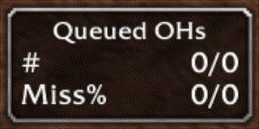

# HsQueue

HsQueue is an addon for WoW Classic that tracks how many times you
have heroic strike or cleave queued when hitting with your off-hand.

A warrior dual-wielding in WoW Classic has a hit-penalty for the
off-hand. This hit penalty is removed if the main-hand has a special
ability (heroic strike or cleave) queued as the off-hand hits. This is
commonly referred to as heroic strike queueing.

The addon consists of a little statistics window that shows:
1. The number of queued off-hand hits vs the number of non-queued off-hand hits.
2. The miss-percentage of the off-hand. This is mainly to showcase the
   actual difference it makes.

Additionally, when the off-hand hits, the little window will either
blink green or red depending on if the main hand has a special ability
queued.

## Usage

Drag the window wherever you please.

If you ever want to reset the statistics in-game, you can run `/hsq reset`.

## Installation
1. Click the download button ("Code") on the Github page, then select
   "Download ZIP"
2. Wait for the zip file to download
3. Unzip the file into Interface\Addons
4. You should now have Interface\Addons\HsQueue\HsQueue.toc

## Notes

I have only played with this solo while levelling and I refuse to
invite a DPS warrior when tanking, so it is untested with more than
one warrior. It should work, but it's not tested.
